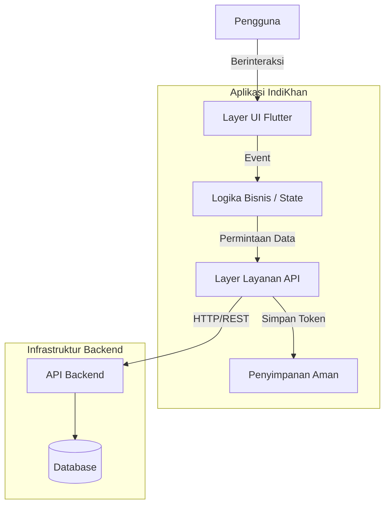
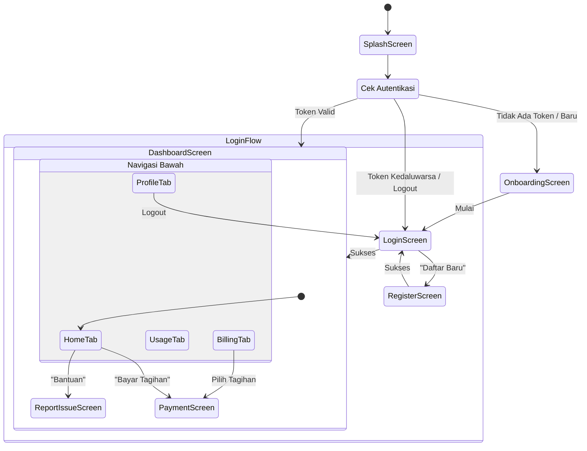
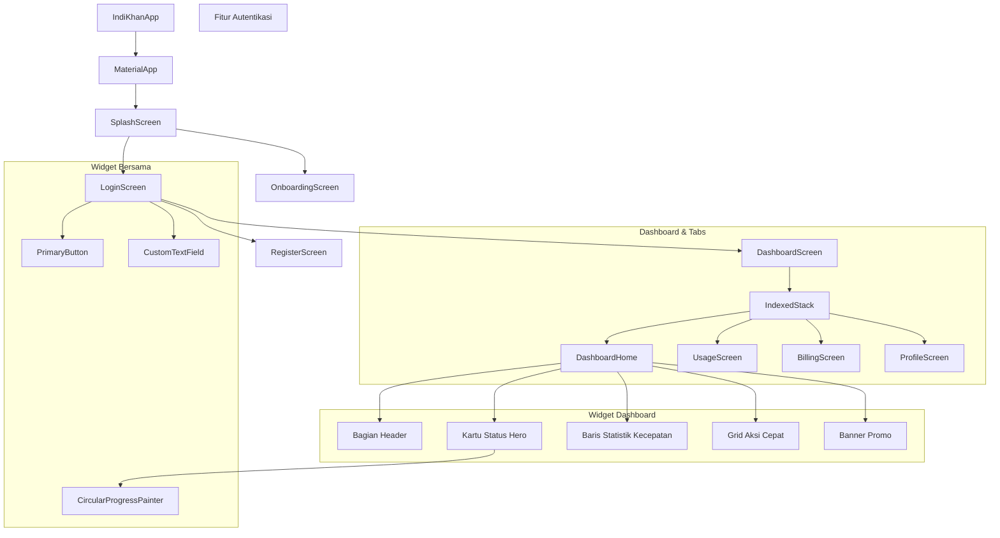

# 📱 IndiKhan - Aplikasi Flutter

Aplikasi mobile untuk pelanggan ISP IndiKhan. Memungkinkan pelanggan untuk melihat paket internet, membayar tagihan, dan membuat tiket dukungan.

## 🛠️ Teknologi yang Digunakan

- **Framework:** Flutter 3.10+
- **Manajemen State:** StatefulWidget (bawaan)
- **HTTP Client:** Dio
- **Penyimpanan:** Flutter Secure Storage
- **Font:** Manrope (Google Fonts)

## 🏗️ Arsitektur Sistem

### Ringkasan
IndiKhan mengikuti struktur berlapis yang terinspirasi dari Clean Architecture untuk memastikan skalabilitas, kemudahan pemeliharaan, dan testabilitas.

| Lapisan | Teknologi | Deskripsi |
|-------|------------|-------------|
| **Presentasi** | Flutter (Dart) | Rendering UI, Widget, Manajemen State |
| **Logika/State** | StatefulWidget | Manajemen state ephemeral bawaan |
| **Jaringan** | Dio | HTTP client untuk komunikasi API |
| **Penyimpanan Lokal** | Flutter Secure Storage | Penyimpanan aman untuk token |
| **Backend** | NestJS (Diasumsikan) | Layanan API RESTful |

### Arsitektur Tingkat Tinggi
Aplikasi berkomunikasi dengan backend REST API melalui kelas `ApiService`. Menggunakan sistem autentikasi berbasis token (JWT) di mana token disimpan secara aman di perangkat.



### Alur Navigasi



### Hirarki Komponen



## 📋 Prasyarat

Sebelum menjalankan proyek ini, pastikan Anda sudah menginstall:

1. **Flutter SDK** (v3.10 atau lebih baru)
   ```bash
   flutter --version
   ```
   Download: https://docs.flutter.dev/get-started/install

2. **Chrome** (untuk pengembangan web)

3. **Android Studio / VS Code** dengan ekstensi Flutter

## 🚀 Petunjuk Instalasi

### 1. Clone Repository
```bash
git clone <url-repo-anda>
cd indikhan
```

### 2. Install Dependencies
```bash
flutter pub get
```

### 3. Konfigurasi URL Backend

Edit file `lib/core/services/api_service.dart`:

```dart
// Untuk development (localhost)
static const String baseUrl = 'http://localhost:3000';

// Untuk production (ganti dengan URL server Anda)
// static const String baseUrl = 'https://api.indikhan.com';
```

### 4. Jalankan Aplikasi

```bash
# Jalankan di Chrome (Web)
flutter run -d chrome

# Jalankan di Emulator Android
flutter run -d android

# Jalankan di Simulator iOS (khusus macOS)
flutter run -d ios

# Lihat semua perangkat yang tersedia
flutter devices
```

## 📁 Struktur Proyek

```
indikhan/
├── lib/
│   ├── core/
│   │   ├── services/
│   │   │   └── api_service.dart    # Klien HTTP & panggilan API
│   │   ├── theme/
│   │   │   ├── app_colors.dart     # Palet warna
│   │   │   ├── app_text_styles.dart # Tipografi
│   │   │   └── app_theme.dart      # ThemeData
│   │   └── widgets/                # Widget yang dapat digunakan kembali
│   ├── features/
│   │   ├── auth/                   # Login & Daftar
│   │   ├── billing/                # Tagihan & Pembayaran
│   │   ├── dashboard/              # Layar Beranda
│   │   ├── onboarding/             # Slide Pengenalan
│   │   ├── profile/                # Profil Pengguna
│   │   ├── splash/                 # Layar Splash
│   │   └── support/                # Lapor Masalah
│   └── main.dart                   # Titik masuk aplikasi
├── pubspec.yaml                    # Dependensi
└── README.md
```

## 🎨 Sistem Desain

IndiKhan menggunakan sistem desain khusus untuk menjaga konsistensi visual di seluruh aplikasi. Desain ini menggunakan "Dark Theme" dengan latar belakang Slate dan aksen Teal/Emerald.

### Palet Warna

Sistem warna didefinisikan di `AppColors` (`lib/core/theme/app_colors.dart`).

#### Warna Utama
| Nama | Hex | Penggunaan |
|------|-----|-------|
| **Primary** | `#0D968B` | Warna merek utama, tombol, status aktif |
| **Primary Light** | `#2DD4BF` | Gradien, sorotan |
| **Primary Dark** | `#0F766E` | Status ditekan |

#### Latar Belakang (Slate)
Digunakan untuk menciptakan kedalaman pada tema gelap.

| Nama | Hex | Penggunaan |
|------|-----|-------|
| **Slate 900** | `#0F172A` | Latar Belakang Utama Aplikasi |
| **Slate 800** | `#1E293B` | Kartu, Bottom Sheets |
| **Slate 700** | `#334155` | Border, Pembatas |

#### Warna Status
| Nama | Hex | Penggunaan |
|------|-----|-------|
| **Success** | `#22C55E` | Aktif, Lunas, Online |
| **Error** | `#EF4444` | Terlambat, Error, Offline |
| **Warning** | `#EAB308` | Menunggu, Peringatan |
| **Info** | `#3B82F6` | Informasi |

### Tipografi

Aplikasi ini menggunakan **Manrope** dari Google Fonts.

| Gaya | Ukuran | Bobot | Penggunaan |
|-------|------|--------|-------|
| **H1** | 28px | Bold | Judul Halaman Utama |
| **H2** | 24px | Bold | Header Bagian |
| **H3** | 20px | SemiBold | Judul Kartu |
| **H4** | 18px | Bold | Sub-bagian |
| **Body Large** | 16px | Normal | Teks penting |
| **Body** | 14px | Normal | Teks default |
| **Caption** | 12px | Normal | Petunjuk, metadata |

## 🔗 Integrasi Backend & API

Aplikasi ini membutuhkan **indikhan-backend** untuk berjalan. Pastikan backend sudah disiapkan dan berjalan sebelum menggunakan aplikasi.

```bash
# Clone backend
git clone <url-repo-backend>
cd indikhan-backend
npm install
npm run start:dev
```

### Dokumentasi API

Aplikasi berinteraksi dengan layanan backend menggunakan `Dio`.

**URL Dasar:**
- Development: `http://localhost:3000`
- Production: `https://riskhan-backend-production.up.railway.app`

#### Autentikasi (`/auth`)
- **Login**: `POST /auth/login` (Body: email, password) → Mengembalikan JWT
- **Daftar**: `POST /auth/register` (Body: nama, email, password, telepon, alamat)
- **Lihat Profil**: `GET /auth/profile` (Wajib Auth)

#### Tagihan (`/billing`)
- **Lihat Tagihan**: `GET /billing/invoices` (Wajib Auth)

#### Tiket (`/tickets`)
- **Lihat Tiket**: `GET /tickets` (Wajib Auth)
- **Buat Tiket**: `POST /tickets` (Body: subjek, deskripsi, kategori)

## 🔧 Pemecahan Masalah

### Error: Connection refused to backend
- Pastikan backend sudah berjalan di `http://localhost:3000`
- Untuk Emulator Android, gunakan `http://10.0.2.2:3000`

### Error: Flutter SDK not found
```bash
# Tambahkan Flutter ke PATH
export PATH="$PATH:/path/to/flutter/bin"
```

### Error: Dependencies outdated
```bash
flutter pub upgrade
```
