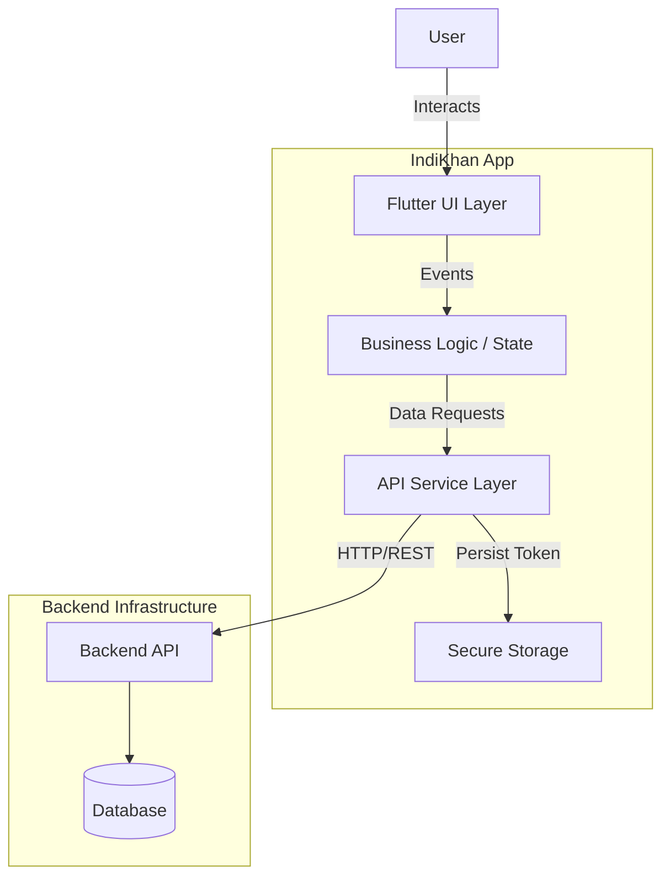
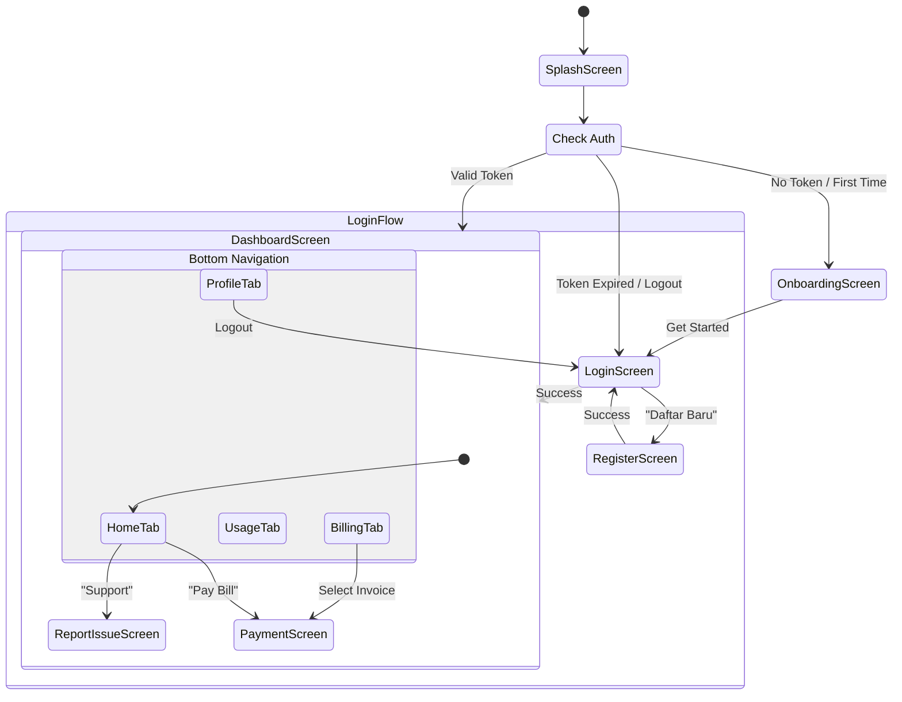
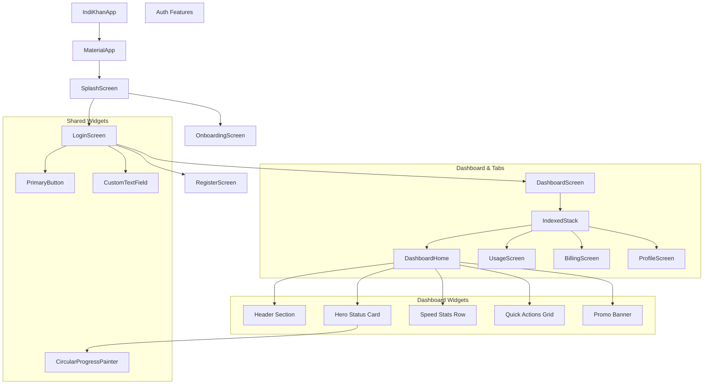

# 📱 IndiKhan - Flutter App

Aplikasi mobile untuk pelanggan ISP IndiKhan. Memungkinkan pelanggan untuk melihat paket internet, membayar tagihan, dan membuat tiket dukungan.

## 🛠️ Tech Stack

- **Framework:** Flutter 3.10+
- **State Management:** StatefulWidget (built-in)
- **HTTP Client:** Dio
- **Storage:** Flutter Secure Storage
- **Font:** Manrope (Google Fonts)

## 🏗️ System Architecture

### Overview
IndiKhan follows a Clean Architecture-inspired layered structure to ensure scalability, maintainability, and testability.

| Layer | Technology | Description |
|-------|------------|-------------|
| **Presentation** | Flutter (Dart) | UI rendering, Widgets, State Management |
| **Logic/State** | StatefulWidget | Built-in ephemeral state management |
| **Networking** | Dio | HTTP client for API communication |
| **Local Storage** | Flutter Secure Storage | Secure persistence for tokens |
| **Backend** | NestJS (Assumed) | RESTful API Service |

### High-Level Architecture
The application communicates with a backend REST API via the `ApiService` class. It uses a token-based authentication system (JWT) where the token is persisted securely on the device.



### Navigation Flow



### Component Hierarchy



## 📋 Prerequisites

Sebelum menjalankan proyek ini, pastikan Anda sudah menginstall:

1. **Flutter SDK** (v3.10 atau lebih baru)
   ```bash
   flutter --version
   ```
   Download: https://docs.flutter.dev/get-started/install

2. **Chrome** (untuk web development)

3. **Android Studio / VS Code** dengan Flutter extension

## 🚀 Setup Instructions

### 1. Clone Repository
```bash
git clone <your-repo-url>
cd indikhan
```

### 2. Install Dependencies
```bash
flutter pub get
```

### 3. Configure Backend URL

Edit file `lib/core/services/api_service.dart`:

```dart
// Untuk development (localhost)
static const String baseUrl = 'http://localhost:3000';

// Untuk production (ganti dengan URL server Anda)
// static const String baseUrl = 'https://api.indikhan.com';
```

### 4. Jalankan Aplikasi

```bash
# Jalankan di Chrome (Web)
flutter run -d chrome

# Jalankan di Android Emulator
flutter run -d android

# Jalankan di iOS Simulator (macOS only)
flutter run -d ios

# List semua devices yang tersedia
flutter devices
```

## 📁 Project Structure

```
indikhan/
├── lib/
│   ├── core/
│   │   ├── services/
│   │   │   └── api_service.dart    # HTTP client & API calls
│   │   ├── theme/
│   │   │   ├── app_colors.dart     # Color palette
│   │   │   ├── app_text_styles.dart # Typography
│   │   │   └── app_theme.dart      # ThemeData
│   │   └── widgets/                # Reusable widgets
│   ├── features/
│   │   ├── auth/                   # Login & Register
│   │   ├── billing/                # Invoice & Payment
│   │   ├── dashboard/              # Home screen
│   │   ├── onboarding/             # Onboarding slides
│   │   ├── profile/                # User profile
│   │   ├── splash/                 # Splash screen
│   │   └── support/                # Report issue
│   └── main.dart                   # App entry point
├── pubspec.yaml                    # Dependencies
└── README.md
```

## 🎨 Design System

IndiKhan uses a specific design system to maintain visual consistency across the application. The design is "Dark Themed" with Slate backgrounds and Teal/Emerald accents.

### Color Palette

The color system is defined in `AppColors` (`lib/core/theme/app_colors.dart`).

#### Primary Colors
| Name | Hex | Usage |
|------|-----|-------|
| **Primary** | `#0D968B` | Main brand color, buttons, active states |
| **Primary Light** | `#2DD4BF` | Gradients, highlights |
| **Primary Dark** | `#0F766E` | Pressed states |

#### Backgrounds (Slate)
Used for creating depth in the dark theme.

| Name | Hex | Usage |
|------|-----|-------|
| **Slate 900** | `#0F172A` | Main App Background |
| **Slate 800** | `#1E293B` | Cards, Bottom Sheets |
| **Slate 700** | `#334155` | Borders, Dividers |

#### Status Colors
| Name | Hex | Usage |
|------|-----|-------|
| **Success** | `#22C55E` | Active, Paid, Online |
| **Error** | `#EF4444` | Overdue, Error, Offline |
| **Warning** | `#EAB308` | Pending, Alert |
| **Info** | `#3B82F6` | Information |

### Typography

The application uses **Manrope** from Google Fonts.

| Style | Size | Weight | Usage |
|-------|------|--------|-------|
| **H1** | 28px | Bold | Main Page Titles |
| **H2** | 24px | Bold | Section Headers |
| **H3** | 20px | SemiBold | Card Titles |
| **H4** | 18px | Bold | Sub-sections |
| **Body Large** | 16px | Normal | Important text |
| **Body** | 14px | Normal | Default text |
| **Caption** | 12px | Normal | Hints, metadata |

## 🔗 Backend Integration & API

Aplikasi ini membutuhkan **indikhan-backend** untuk berjalan. Pastikan backend sudah setup dan running sebelum menggunakan aplikasi.

```bash
# Clone backend
git clone <backend-repo-url>
cd indikhan-backend
npm install
npm run start:dev
```

### API Documentation

The application interfaces with the backend services using `Dio`.

**Base URL:**
- Development: `http://localhost:3000`
- Production: `https://riskhan-backend-production.up.railway.app`

#### Authentication (`/auth`)
- **Login**: `POST /auth/login` (Body: email, password) → Returns JWT
- **Register**: `POST /auth/register` (Body: name, email, password, phone, address)
- **Get Profile**: `GET /auth/profile` (Auth required)

#### Billing (`/billing`)
- **Get Invoices**: `GET /billing/invoices` (Auth required)

#### Tickets (`/tickets`)
- **Get Tickets**: `GET /tickets` (Auth required)
- **Create Ticket**: `POST /tickets` (Body: subject, description, category)

## 🔧 Troubleshooting

### Error: Connection refused to backend
- Pastikan backend sudah running di `http://localhost:3000`
- Untuk Android Emulator, gunakan `http://10.0.2.2:3000`

### Error: Flutter SDK not found
```bash
# Tambahkan Flutter ke PATH
export PATH="$PATH:/path/to/flutter/bin"
```

### Error: Dependencies outdated
```bash
flutter pub upgrade
```
