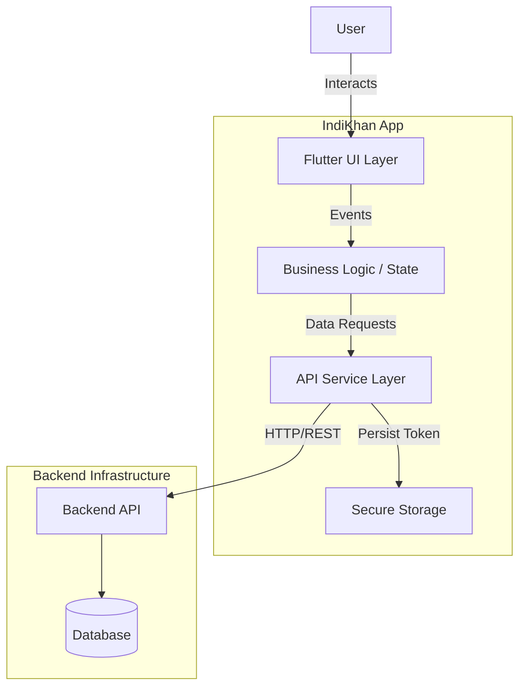

# System Architecture

## Overview
IndiKhan is a mobile application developed using Flutter, designed for ISP customers to manage their internet subscriptions, pay bills, and report issues. It follows a Clean Architecture-inspired layered structure to ensure scalability, maintainability, and testability.

## Technology Stack

| Layer | Technology | Description |
|-------|------------|-------------|
| **Presentation** | Flutter (Dart) | UI rendering, Widgets, State Management |
| **Logic/State** | StatefulWidget | Built-in ephemeral state management |
| **Networking** | Dio | HTTP client for API communication |
| **Local Storage** | Flutter Secure Storage | Secure persistence for tokens |
| **Backend** | NestJS (Assumed) | RESTful API Service |

## High-Level Architecture

The application communicates with a backend REST API via the `ApiService` class. It uses a token-based authentication system (JWT) where the token is persisted securely on the device.

## Layered Structure

The project is organized into `core` and `features` directories:

- **Core**: Contains shared resources, utilities, and services used across the application.
  - `services/`: API handling, storage services.
  - `theme/`: Design tokens (Colors, Typography).
  - `widgets/`: Reusable UI components.

- **Features**: Functional modules of the application.
  - `auth/`: Authentication flow (Login, Register).
  - `dashboard/`: Main hub, speed stats, quick actions.
  - `billing/`: Invoice history and payments.
  - `profile/`: User settings.
  - `support/`: Ticket creation.

## Data Flow

1.  **Request**: User triggers an action (e.g., Login).
2.  **Service Call**: `ApiService` constructs a request using `Dio`.
3.  **Interceptors**: Dio interceptors automatically attach the JWT token if available.
4.  **Response**: The backend responds with data or error.
5.  **State Update**: The UI receives the response and updates the state (via `setState`).

## Security
- **Secure Storage**: JWT tokens and sensitive session data are stored using `flutter_secure_storage`, ensuring they are encrypted on the device.
- **HTTPS**: All communication with the backend is done over HTTPS.
