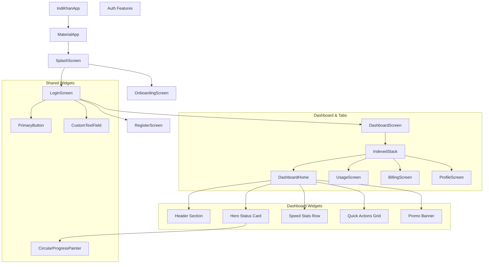

# Component Hierarchy

The following diagram illustrates the high-level hierarchy of widgets and screens in the IndiKhan application.

```mermaid
graph TD
    App[IndiKhanApp] --> MaterialApp
    MaterialApp --> Splash[SplashScreen]
    
    auth[Auth Features]
    Splash --> Login[LoginScreen]
    Splash --> Onboard[OnboardingScreen]
    Login --> Register[RegisterScreen]
    Login --> Dashboard[DashboardScreen]
    
    subgraph "Dashboard & Tabs"
        Dashboard --> IndexedStack
        IndexedStack --> DashHome[DashboardHome]
        IndexedStack --> Usage[UsageScreen]
        IndexedStack --> Billing[BillingScreen]
        IndexedStack --> Profile[ProfileScreen]
    end
    
    subgraph "Dashboard Widgets"
        DashHome --> Header[Header Section]
        DashHome --> HeroCard[Hero Status Card]
        DashHome --> Speed[Speed Stats Row]
        DashHome --> Actions[Quick Actions Grid]
        DashHome --> Banner[Promo Banner]
    end
    
    subgraph "Shared Widgets"
        Login --> CustomButton[PrimaryButton]
        Login --> CustomInput[CustomTextField]
        HeroCard --> Progress[CircularProgressPainter]
    end
```
