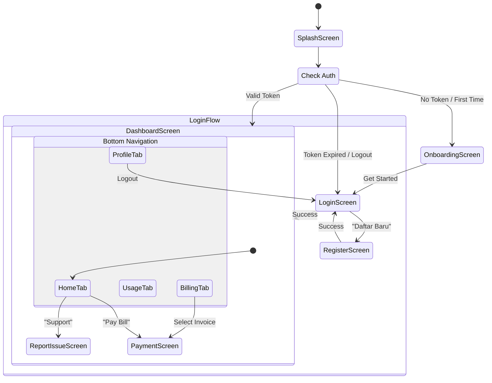

# Application Navigation Flow

This document details the navigation paths within the IndiKhan application.

## Navigation Diagram

```mermaid
stateDiagram-v2
    [*] --> SplashScreen
    
    state "Check Auth" as CheckAuth
    SplashScreen --> CheckAuth
    
    CheckAuth --> OnboardingScreen : No Token / First Time
    CheckAuth --> LoginScreen : Token Expired / Logout
    CheckAuth --> DashboardScreen : Valid Token
    
    OnboardingScreen --> LoginScreen : Get Started
    
    state LoginFlow {
        LoginScreen --> RegisterScreen : "Daftar Baru"
        RegisterScreen --> LoginScreen : Success
        LoginScreen --> DashboardScreen : Success
    }
    
    state DashboardScreen {
        [*] --> HomeTab
        
        HomeTab --> PaymentScreen : "Pay Bill"
        HomeTab --> ReportIssueScreen : "Support"
        
        state "Bottom Navigation" as BottomNav {
            HomeTab
            UsageTab
            BillingTab
            ProfileTab
        }
    }
    
    BillingTab --> PaymentScreen : Select Invoice
    ProfileTab --> LoginScreen : Logout
```
